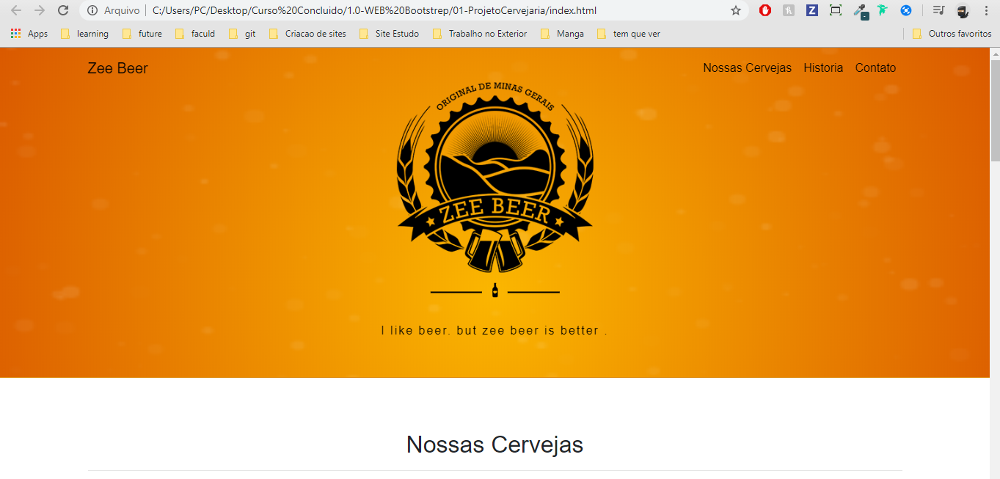
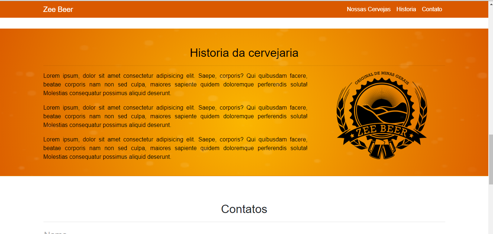
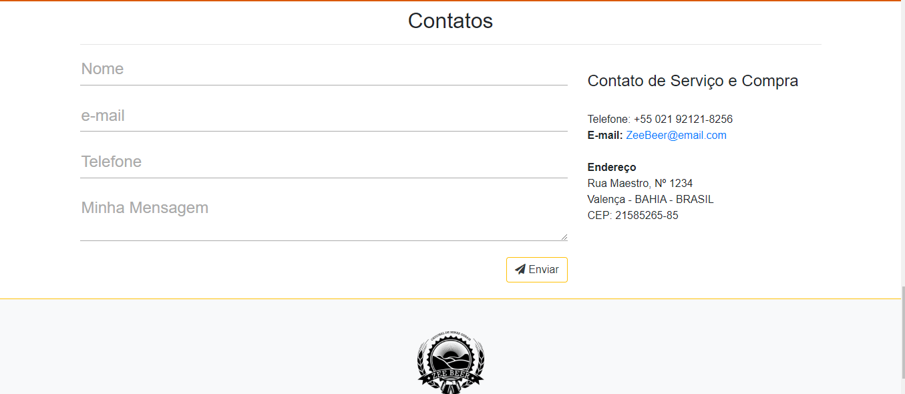

# Curso-Bootstrap
Este repositório foi criado para armazenar o projeto do curso de bootstrap 

# Techs
<h4>HTML</h4>
<h4>CSS</h4>
<h4>Javascript(jquery)</h4>
<h4>bootstrap</h4>

o Desenvolvimento desse projeto é focado em Bootstrap e foi idealizado pelo autor do curso.

segue link do curso --> https://www.udemy.com/course/bootstrap-4-ozirispc/
